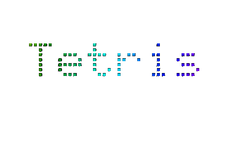

<link href="https://fonts.googleapis.com/css2?family=Doto&display=swap" rel="stylesheet">

<div style="text-align: center;">
  
</div>


# Sobre o Jogo:
<p>🕹️ Tetris é um jogo simples e intuitivo. Basta conectar os blocos de diferentes formatos e cores uns nos outros para formar uma linha horizontal que vai de um canto da tela até o outro, garantindo pontos.

Porém, neste Tetris que eu criei, as coisas não são tão simples. Ele é composto por 3 níveis de dificuldade que aumentam conforme sua pontuação. Chegando a um nível que é praticamente impossível! 🕹️</p>
<br>

## Índice:
-[ 🕹️ Sobre o Jogo](#sobre-o-jogo)

-[ 🚀 Como Instalar](#como-instalar)

-[ 👻 Como Jogar](#como-jogar)

-[ 👨🏽‍💻 Equipe de Desenvolvimento](#equipe-de-desenvolvimento)

-[ 📎 Links](#links)

-[ 💻 Tecnologias Usadas](#tecnologias-usadas)

<br>

# Como Instalar:
🚀 Antes de começar, você va precisar tar instalado em sua maquina as seguintes ferramentas: [Git](https://git-scm.com/) , [Python ou Python3](https://www.python.org/). Além disso tenha uma IDE de sua preferencia, caso não tenha nenhuma minha sugestão e o [Vscode](https://code.visualstudio.com/). 🚀

```bash
#Clone esse repositório
$ git clone https://github.com/Felip3monteiro/Jogo_complexidade.git

#Acesse a pasta que foi clonada
$ cd Jogo_complexidade

#Instale as Bibliotecas do Python necessarias
$ pip install pygame
$ pip install Flask
```

# Como Jogar:
👻 Agora para Rodar e jogar o jogo como faz? SIMPLES!! basta abrir o arquivo **app.py** e rodar na sua IDE.
Caso queria rodar no terminal utilize os seguinte comando:

```bash
#Rode o app.py com o seguinte comando:
$ Python app.py

#Caso tenha o python3 instalado o comando é:
$ Python3 app.py
```

# Equipe de Desenvolvimento:
👨🏽‍💻 Felipe Monteiro Silveira - 31555675


# Links:
📧 felipesilveiramonteiro@gmail.com

▶️ https://youtu.be/TZm6StM4pDU


# Tecnologias Usadas:
🐍 Python

📝 Html

📄 Java Script


# Checklist

# Fase 1: Análise [Felipe] 

[ Felipe ] Problema selecionado e definido claramente.

[ Felipe ]  Compreensão aprofundada da natureza e desafios do problema.

[ Felipe ] Modelo matemático ou teórico desenvolvido para representar o problema.

# Fase 2: Planejamento [Felipe] 

 [ Felipe ] Objetivos do algoritmo definidos com clareza.
 
 [ Felipe ] Métricas para avaliação de eficiência do algoritmo estabelecidas.
 
 [ Felipe ] Estratégia geral de resolução do problema proposta.
 
 [ Felipe ] Subproblemas identificados e divididos, se aplicável.
 
 [ Felipe ] Estrutura geral do algoritmo esboçada.
 
 [ Felipe ] Casos limite ou situações especiais identificados.
 
 [ Felipe ] Análise teórica realizada para verificar a correção do algoritmo.
 
# Fase 3: Desenho [Felipe] 

 [ Felipe ] Análise de complexidade realizada para avaliar a eficiência teórica do algoritmo.
 
 [ Felipe ] Pontos críticos do algoritmo identificados para otimização, se necessário.
 
# Fase 4: Programação e Teste [Felipe ] 

[ Felipe ] Algoritmo traduzido com precisão em código de programação.

[ Felipe ] Código de programação escrito de forma clara e organizada.

[ Felipe ]  Testes rigorosos realizados em uma variedade de casos de teste.

[ Felipe ] Casos limite e situações especiais testados.

[ Felipe ] Erros e problemas durante o teste de programa identificados e corrigidos.

# Documentação e Avaliação do Projeto [Felipe] 

 [ Felipe ] Documentação completa, incluindo especificação do algoritmo e análise de complexidade.
 
 [ Felipe ] Documentação revisada para clareza e rigor técnico.
 
 [ Felipe ] Avaliação da eficácia do algoritmo em termos de tempo de execução, uso de recursos e precisão na resolução do problema.
 
 [ Felipe ] Avaliação da colaboração da equipe e cumprimento dos prazos.

# Apresentação e Conclusão do Projeto [Felipe] 

[ Felipe ] Apresentação do projeto preparada com informações claras e objetivas.

[ Felipe ] Conclusões do projeto destacando os resultados e aprendizados.

[ Felipe ] Discussão sobre o projeto e respostas a perguntas da audiência.


